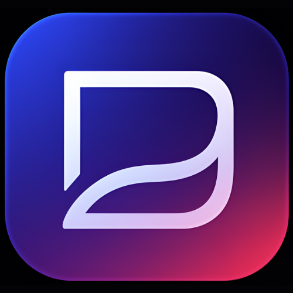
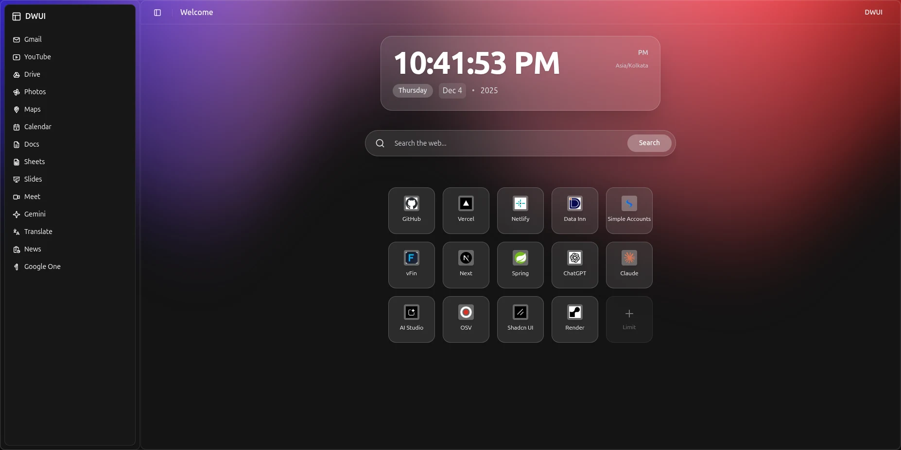
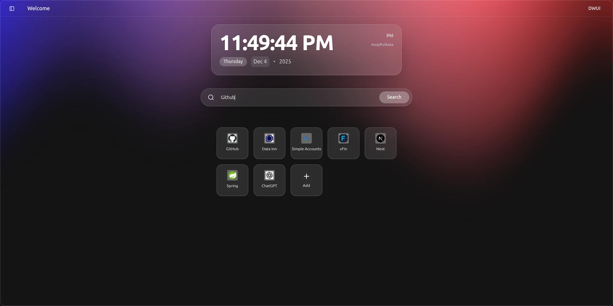

<p align="center">
  
</p>

<h1 align="center">DWUI - Dynamic Web User Interface</h1>

<p align="center">Transform your boring Chrome new tab into a stunning, modern interface with glassmorphism effects and smooth animations.</p>

<p align="center">
  <a href="https://choosealicense.com/licenses/mit/">
    
  </a>
  <a href="https://reactjs.org/">
    
  </a>
  <a href="https://www.typescriptlang.org/">
    
  </a>
  <a href="https://vitejs.dev/">
    
  </a>
  <a href="https://ui.shadcn.com/">
    
  </a>
  <a href="https://github.com/mohammadumar-dev/dwui-new-tab/releases">
    
  </a>
</p>

## 🛒 Browser Store Availability

🚀 **Coming soon to:**

- **Chrome Web Store** – Coming soon 
- **Microsoft Edge Add-ons Store** – Coming soon  

## 📸 Screenshots

<!-- Add your screenshots here -->

### 🌌 DWUI Preview

*A stunning glassmorphic interface enhanced with an aurora-style backdrop.*

---

### 🔍 Search Feature

*Integrated Chrome search with a sleek modern UI.*

---

### 🧩 Shortcuts Grid

*A customizable shortcuts grid with a minimal dark sidebar.*


## ✨ Features

- 🎨 **Modern UI Components** – Built with Shadcn UI and React Bits Aurora components  
- ✨ **Glassmorphism Design** – Elegant, glass-like transparency across the interface  
- 🌊 **Aurora Background** – Smooth, animated gradient background powered by WebGL  
- 🔍 **Smart Search** – Integrated Chrome search API for fast, seamless web searching  
- ⏰ **Digital Clock** – Real-time clock with accurate timezone handling  
- 🔗 **Quick Access Sidebar** – Instant access to Google apps and essential tools  
- 📱 **Shortcuts Grid** – Add or remove custom shortcuts for your favorite websites  
- 🌙 **Dark Theme** – Fully optimized dark-only interface for a sleek, modern look  


## 🚀 Getting Started

### Prerequisites

Before you begin, make sure you have the following installed:
- [Node.js](https://nodejs.org/) (v18 or higher)
- [npm](https://www.npmjs.com/) or [yarn](https://yarnpkg.com/)
- Google Chrome browser

### Installation

1. **Clone the repository**
   ```bash
   git clone https://github.com/mohammadumar-dev/dwui-new-tab.git
   cd dwui-new-tab
   ```

2. **Install dependencies**
   ```bash
   npm install
   # or
   yarn install
   ```

3. **Build the extension**
   ```bash
   npm run build
   # or
   yarn build
   ```
   This creates a `dist` folder with your extension files.

4. **Load the extension in Chrome**
   - Open Chrome and navigate to `chrome://extensions/`
   - Enable **Developer mode** (toggle in the top-right corner)
   - Click **Load unpacked**
   - Select the `dist` folder from your project directory
   - Your new tab is now active! 🎉

## 🛠️ Development

### Run in Development Mode

```bash
npm run dev
# or
yarn dev
```

This starts the Vite development server. You can view your changes at `http://localhost:5173`.

> **Note:** Some Chrome API features (like search) won't work in dev mode. Build and load the extension to test these features.

### Project Structure

```
dwui-new-tab/
├── public/
│   ├── manifest.json      # Chrome extension manifest
│   └── vite.svg
├── src/
│   ├── components/
│   │   ├── ui/            # Shadcn UI components
│   │   ├── Aurora.tsx     # Animated background
│   │   ├── DigitalClock.tsx
│   │   ├── SearchBar.tsx  # Chrome search integration
│   │   ├── ShortcutsGrid.tsx
│   │   └── app-sidebar.tsx
│   ├── hooks/             # Custom React hooks
│   ├── lib/               # Utility functions
│   ├── App.tsx            # Main application component
│   ├── main.tsx           # Application entry point
│   └── globals.css        # Global styles
├── package.json
└── vite.config.ts
```

## 🎨 Customization

### Change Aurora Colors

Edit the color stops in `App.tsx`:

```tsx
<Aurora
  colorStops={["#3A29FF", "#FF94B4", "#FF3232"]} // Change these hex colors
  blend={0.5}
  amplitude={1}
  speed={0.35}
/>
```

### Adjust Clock Timezone

Modify the timezone prop in `App.tsx`:

```tsx
<DigitalClock 
  timezone="America/New_York"  // Change to your timezone
  hour12={true}                 // Set false for 24-hour format
/>
```

### Add Custom Shortcuts

The shortcuts are stored locally in the browser. You can add, edit, or delete shortcuts directly from the interface using the grid layout.

## 🔧 Tech Stack

| Technology | Purpose |
|------------|---------|
| [React 19](https://react.dev/) | UI framework |
| [TypeScript](https://www.typescriptlang.org/) | Type safety |
| [Vite](https://vitejs.dev/) | Build tool & dev server |
| [Shadcn UI](https://ui.shadcn.com/) | UI component library |
| [Tailwind CSS](https://tailwindcss.com/) | Styling |
| [OGL](https://github.com/oframe/ogl) | WebGL for Aurora effect |
| [dnd-kit](https://dndkit.com/) | Drag and drop functionality |
| [Lucide Icons](https://lucide.dev/) | Icon library |

## 📦 Build for Production

To create an optimized production build:

```bash
npm run build
```

The build artifacts will be in the `dist/` folder, ready to be loaded as an unpacked extension or packaged for distribution.

## 🤝 Contributing

Contributions are welcome! Here's how you can help:

1. Fork the repository
2. Create a feature branch (`git checkout -b feature/AmazingFeature`)
3. Commit your changes (`git commit -m 'Add some AmazingFeature'`)
4. Push to the branch (`git push origin feature/AmazingFeature`)
5. Open a Pull Request

## 📝 License

This project is licensed under the MIT License - see the [LICENSE](LICENSE) file for details.

## 🙏 Acknowledgments

- [Shadcn UI](https://ui.shadcn.com/) for the beautiful component library
- [OGL](https://github.com/oframe/ogl) for the WebGL aurora effect
- The React and Vite communities for excellent tools

## 📧 Contact

Mohammad Umar  
- GitHub: [@mohammadumar-dev](https://github.com/mohammadumar-dev)  
- Email: [mohammadumar.dev@gmail.com](mailto:mohammadumar.dev@gmail.com)  
- Portfolio: [mohammadumar-dev](https://mohammadumar-dev.netlify.app)

Project Link: [https://github.com/mohammadumar-dev/dwui-new-tab](https://github.com/mohammadumar-dev/dwui-new-tab)


---

<p align="center">Made with ❤️ by Mohammad Umar</p>
<p align="center">If you find this project useful, please consider giving it a ⭐</p>
